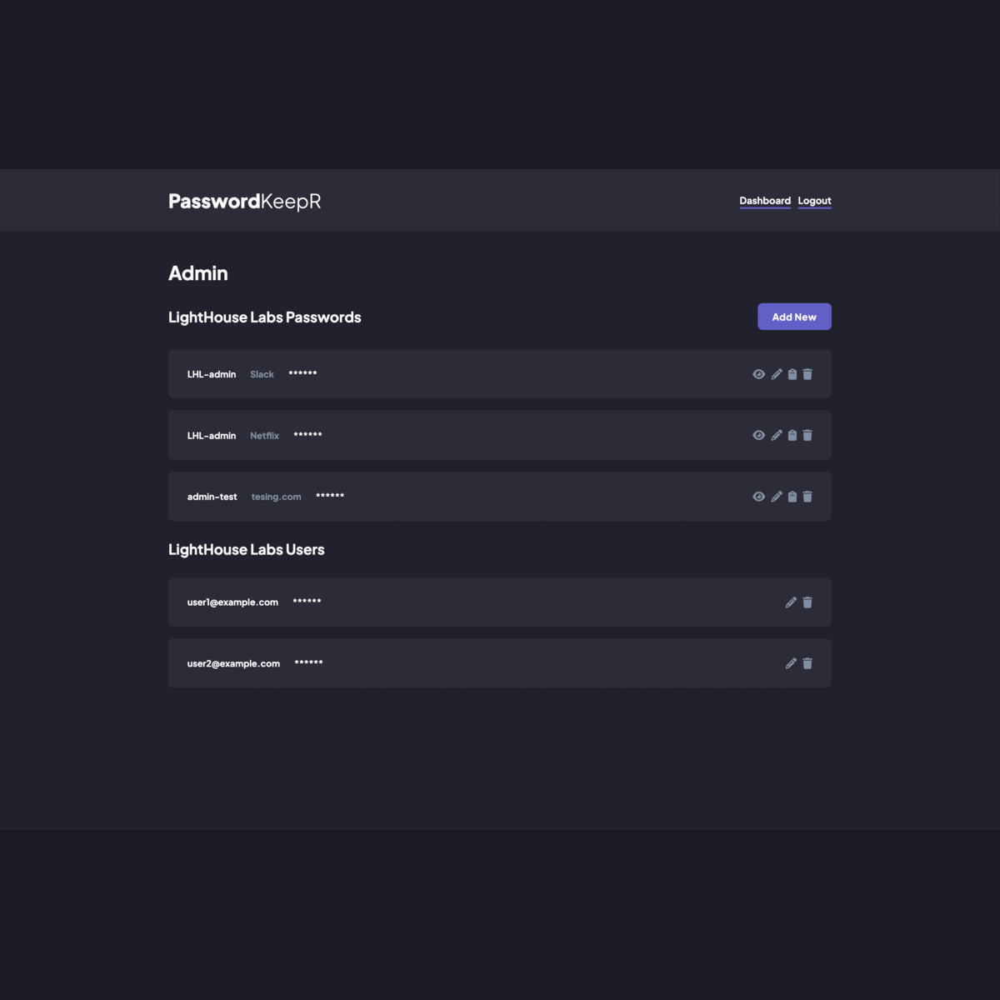

# PasswordKeepR - Password Manager Application

This is a password manager web application that helps users store and manage their passwords securely.

## Table Of Contents

- [Overview](#overview)
  - [Requirements](#the-challenge)
  - [Screenshot](#screenshot)
  - [Links](#links)
- [The process](#my-process)
  - [Built With](#built-with)
  - [What We Learned](#what-we-learned)
  - [Continued Development](#continued-development)
  - [Useful Resources](#useful-resources)
- [Authors](#authors)

### Requirements

Users should be able to:

- user can register/login and be assigned to an organization
- an organization has many users
- user can add a new username and password for a specific website
- app can generate passwords based on the criteria specified (password length, contains lowercase, contairs uppercase, contains numbers, etc)
- user can edit and change their password any time
- user has a convinient copy to clipboard button so they dont have to select the password
- sites can be categoried, to, social (fb, linkedin), work related (bamboo, harvest), entertainment (snapchat, reddit), etc, etc

### Screenshots

### Links

- [Live Site URL]()

## The Process

### Built With:

- Semantic HTML5 Markup
- CSS Custom Properties
- Mobile-first workflow
- JavaScript
- [SASS/SCSS](https://sass-lang.com/) - CSS preprocessor
- [Node.js](https://nodejs.org/en) - JavaScript runtime
- [Express](https://expressjs.com/) - NodeJS framework
- [PostgresSQL](https://www.postgresql.org/) - Relational database
- [crypto-js](https://www.npmjs.com/package/crypto-js) - JS library for encryption/decryption
- [bcrypt](https://www.npmjs.com/package/bcrypt) - NodeJS library for hashing

### What we learned

Working with databases: We gained experience in setting up and working with a PostgreSQL database, including creating tables, defining relationships, and writing SQL queries to retrieve and manipulate data.

Server-side development: We developed our skills in server-side programming using Node.js and the Express.js framework, including routing, middleware, and handling HTTP requests and responses.

Authentication and authorization: We implemented a basic user authentication and authorization system, which involved working with cookies, sessions, and password hashing using bcrypt.

Front-end development: We developed our skills in front-end development using HTML, CSS, and JavaScript, and using AJAX to make asynchronous requests to the server.

Project management and collaboration: We gained experience working as a team, using version control with Git, and managing project architecture and tasks using Miro

### Continued Development

Security

- Currently, users can input any organization name they like, even if they do not belong to that organization, which can be a security issue. One possible solution is to add domain verification or require authentication from the organization before allowing users to register. Two-factor authentication could also add an extra layer of security to the login process.

User Experience

- Search Functionality: Add the ability to search by attributes such as category, website, or username to improve the overall user experience and make it easier for users to find the passwords they need.
- Allow users to create their own categories: Provide more flexibility and allow users to better organize their passwords according to their needs.
- Role-based access control: Allow organizations to assign different levels of access to users based on their roles within the organization.
- Password Generator Integration: Integrate the password generator into the add password and edit password modals to streamline the password management process.

## Authors

- Sean Gray
  - [Github](https://github.com/seangray-dev)
- Conlan Schafer
  - [Github](https://github.com/ConlanSchool)
- Shujie Ma
  - [GitHub](https://github.com/shujie1st)
